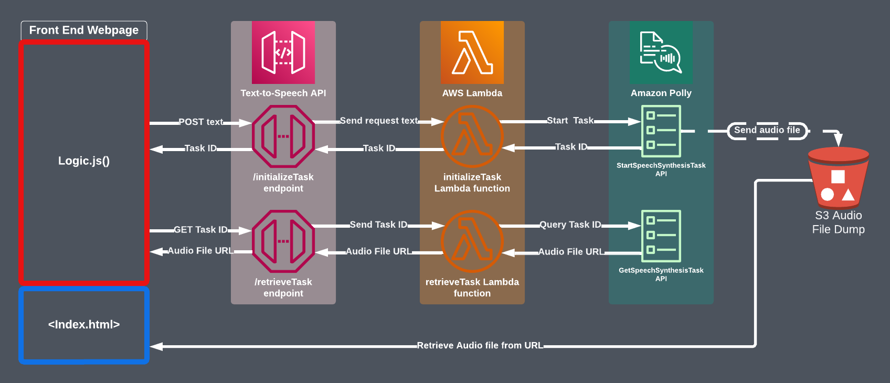

# AWS-Serverless-Text-to-Speech-With-Frontend
This repo contains the code and instructions necessary for creating a simple, serverless text-to-speech application using AWS services. I also provide a simple HTML/JavaScript frontend for interfacing with the application.

## Architectural overview
Text-to-speech functionality is powered by [Amazon Polly](https://aws.amazon.com/polly/). Text requests are sent to an API Gateway API in the form of an HTTP POST payload. This payload gets parsed by a Lambda function before being submitted to Polly to synthesize the audio file.

After the request has been made, the returned Synthesis Task ID is sent back to the API (down a different route) to see if the task is complete. If so, an S3 object URL pointing to the synthesized audio file is given to the user. Otherwise, the script waits a moment then tries again until the task is complete, an error is thrown, or the task times out. Request intervals increase linearly between tries to limit throttling in a linear [backoff model](https://docs.aws.amazon.com/general/latest/gr/api-retries.html).

All of the scripts in the frontend logic are run asynchronously. This 

<details><Summary>See the architectural diagram</summary>

 
</details>

## Installation
#### I. Prerequisites
The code provided by this repository assumes that you have the following resources set up: 
1. A web server capable of hosting a static site. [S3 is a great option](https://docs.aws.amazon.com/AmazonS3/latest/userguide/WebsiteHosting.html) for static web hosting, or you can [run a server locally](https://developer.mozilla.org/en-US/docs/Learn/Common_questions/Tools_and_setup/set_up_a_local_testing_server).
3. Set up the [AWS CLI](https://docs.aws.amazon.com/cli/latest/userguide/getting-started-install.html) and the [Terraform CLI](https://developer.hashicorp.com/terraform/tutorials/aws-get-started/install-cli) and [configure the two to work together](https://developer.hashicorp.com/terraform/tutorials/aws-get-started/aws-build).

#### II. Set Up AWS Resources

1. Create an S3 bucket with public Read Only access. 
   - Optionally, set up a lifecycle policy on this bucket to automatically delete speech synthesis files after some amount of time.
2. Create two Lambda functions named `TTS_initializeTask` and `TTS_retrieveTask`, or something similar. Configure these fuctions with the following settings: 
   - Python 3.9 Runtime
   - x86_64 architecture
   - Runtime execution role that allows `Polly:StartSpeechSynthesisTask` and `Polly:GetSpeechSynthesisTask`, in addition to the Default Lambda Execution Role permissions.
3. Add the following environment variables to the TTS_initializeTask Lambda function, substituting `<BUCKET_NAME>` with the name of the public bucket initialized in step 1:
```
   {
       BucketName: <BUCKET_NAME>,
       KeyPrefix: "TTS/TTS"
   }
```
4. Upload the Python code from "TTS_initializeTask.py" and "TTS_retrieveTask.py" to their respective Lambda functions and deploy.
5. Test for good installation. See "Test Cases" below.

#### III. Prepare API Gateway with Terraform
1. Download the contents of the Terraform folder to a local directory.
2. Run `terraform build`, `terraform plan`, then `terraform apply` commands from the local directory.
3. Specify optional and required parameters during the plan and apply stage.
4. Note the "api_invocation_url" output value.
5. Test for good installation. See "Test Cases" below.

#### IV. Configure Frontend
1. Download the contents of the Webfiles folder to local directory.
2. In "logic.js", line 1 and 2, change `<API_URL>` to the api_invocation_url return in step III.4 above.
3. Upload the "error.html", "index.html", and "logic.js" to a web server.

## Resource Details
### Lambda Function: TTS_initializeTask
TTS_initializeTask takes in the request passed by TTS-API and pulls the 'body' element out of the JSON-formatted message. After checking to make sure there was well-formatted message (ln. 27) that wasn't too long (ln. 37), it passes the payload to Amazon Polly to begin making the audio file. Polly returns a task ID, which TTS_initializeTask passes back to TTS-API. This function also passes the header `x-tts-bucketkey` which provides what will become the audio file S3 object ID. This can be useful for Step Functions that want to act on the synthesized audio file directly. 

Polly.start_speech_synthesis_task is an asynchronous function. It returns a "task ID", which must be fetched later. Polly saves the finished audio file to S3.

This Python code also contains two functions that may be used to decode Base64-encoded strings. For a given base64-encoded string `text`, the function `httpTextParser(base64Decoder(body))` will return a human-readable string of type `string`.

### Lambda Function: TTS_retrieveTask
TTS_retrieveTask looks through the request passed by TTS-API for an HTTP `x-tts-taskid` header. It then passes this Task ID to Polly to ask whether the task is completed or not. 

If the task is complete, it responds with status code 200 and the link to the S3 object containing the synthesized audio. 

If the task is still scheduled or pending, it responds with status code 302.

Error responses are included in lines 7, 25, and 30.

Receiving the Task ID as a header allows requests from the frontend to be made with a GET request.

### API Gateway: TTS-API
The HTTP API defined in the Terraform template passes requests largely unmodified to their respective Lambda functions. After initialization, Terraform will return an URL enpoint that may be used to invoke its methods. 

The Terraform template accepts the following variables during initialization:

<details><summary>See TTS-API Terraform Variables</summary>

|Variable|Description|
|---|---|
origin*|Defines the access-control-allow-origin variable in the API CORS policy. If hosting the frontend as an S3 static bucket, typically this takes the form http://bucket-name.s3-website[-/.]Region.amazonaws.com. If running the frontend on localhost, "*" is more appropriate.
initializeTask_lambda_name*|Name of the Lambda function containing the code from TTS_initializeTask.py. Typically, this is "TTS_initializeTask".
retrieveTask_lambda_name*|Name of the Lambda function containing the code from TTS_retrieveTask.py. Typically, this is "TTS_retrieveTask".
initializeTask_lambda_qualifier|The Alias name or version number of the initializeTask Lambda function. E.g., $LATEST, my-alias, or 1. Defaults to $LATEST.
retrieveTask_lambda_qualifier|The Alias name or version number of the retrieveTask Lambda function. E.g., $LATEST, my-alias, or 1. Defaults to $LATEST.
default_api_burst_limit|Defaults to 5 to avoid racking up charges.
default_api_rate_limit|Defaults to 5 to avoid racking up charges.

*Required
</details>

TTS-API accepts the following requests:
1. `POST <INVOKE_URL>/initializeTask` accepts a string of text in the body of the request.
2. `GET <INVOKE_URL>/retrieveTask`expects a Polly Task ID to be provided in the custom `x-tts-taskid` header.

### Simple Frontend: Webfiles
At the core of the frontend is a web form HTML element. Upon submission, an event listener sends an asyncronous request to TTS-API to fetch a task ID from Polly through the  *initializeTask*  Lambda function `logic.js/ln:79`. 

Upon successful task ID retrieval, the listener's handler function attempts to fetch the finshed audio file URL from Polly through the *retrieveTask* Lambda function `logic.js/ln:82`. If the task is still pending, the function waits a rest period then tries again. The rest period starts at one second and increases linearly, one additional second per attempt, for a max rest period of 10 seconds. This makes the effective timeout time for the retrieval task about 55 seconds.

## Testing the Resources
The following unit tests may be helpful to make sure that each component is working correctly.

Prerequisites: Start an Amazon Polly asynchronous synthesis task.
1. Go to Amazon Polly > Text-to-Speech. Add any input text you want, then click "Save to S3". Fill in the information for the bucket you made to store synthesis tasks and again click "Save to S3".
2. Go to Amazon Polly > S3 Synthesis Tasks and record the Task ID of the task you just started. Make sure the task is marked "✅ Completed". 
3. Click on the "S3 URL" of the newly synthesized audio file. Find and record the "Object URL" from the S3 console.

<Details><Summary>S3 Read-only Bucket Unit Tests</Summary>

* Attempt to open your Object URL from an Incognito window in your browser. If you can open it, then permissions are suitable adequately public.
</Details>

<Details><Summary>TTS_initializeTask Lambda Function Unit Tests</Summary>
==========================

**Test Case 1**:
```
{
   "body": "This is a test of the initialize task Lambda function"
}
```
**Expected response**: 
```
{
   "isBase64Encoded": False,
   "statusCode": 202,
   "headers": {"x-tts-bucketkey": <SOME_BUCKET_KEY>},
   "body": {"taskId": <SOME_TASK_ID>}
}
```
**Purpose**: Simulates a good request.

==========================

**Test Case 2**:
```
{
   "body": "a b c d e f g h i j k l m n o p q r s t u v w x y z a b c d e f g h i j k l m n o p q r s t u v w x y z"
}
```
**Expected response**: 
```
{
   "statusCode": 413,
   "body": "Your message is too long. Try again"
}
```
**Purpose**: Body > 50 words.

==========================

**Test Case 3**:
```
{
   "body": "ThisIsATestOfARequestWithFewerThanFiftyWordsButMoreThanThreeHundredCharacters ThisIsATestOfARequestWithFewerThanFiftyWordsButMoreThanThreeHundredCharacters ThisIsATestOfARequestWithFewerThanFiftyWordsButMoreThanThreeHundredCharacters ThisIsATestOfARequestWithFewerThanFiftyWordsButMoreThanThreeHundredCharacters"
}
```
**Expected response**: 
```
{
   "statusCode": 413,
   "body": "Your message is too long. Try again"
}
```
**Purpose**: Body > 300 characters.

==========================

**Test Case 4**:
```
{"resource": "/{tts+}", 
   "path": "/", 
   "httpMethod": "GET", 
   "headers": {
      "origin": "null",
      "httpMethod": "GET"
   },
   "isBase64Encoded": false
}
```
**Expected response**: 
```
{
  "statusCode": 400,
  "body": "ERROR: TTS payload not specified"
}
```
**Purpose**: Request with no body (for example, from a GET request)

</Details>

TTS_retrieveTask Lambda Function Unit Tests

==========================
**Test Case 1**:
```
{
   "body": ""
}
```
**Expected response**: 
```
{
   "statusCode": 400,
   "body": "ERROR: TaskID not specified in the x-tts-taskid header."
}
```
**Purpose**: Invalid GET request.

==========================
**Test Case 2**:
```
{
   "headers": {"x-tts-taskid": <YOUR_TASK_ID>}
}
```
**Expected response**: 
```
{
   "statusCode": 200,
   "body": "<BUCKET_OBJECT_URL>"
}
```
**Purpose**: GET valid, complete Task ID.

==========================
**Test Case 3**:
```
{
   "headers": {"x-tts-taskid": "EXAMPLE-fake-id-1234567"}
}
```
**Expected response**: 
```
{
  "statusCode": 400,
  "body": "ERROR: Invalid Task ID."
}
```
**Purpose**: Invalid GET request.

==========================